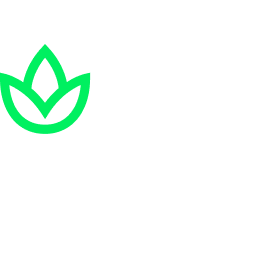
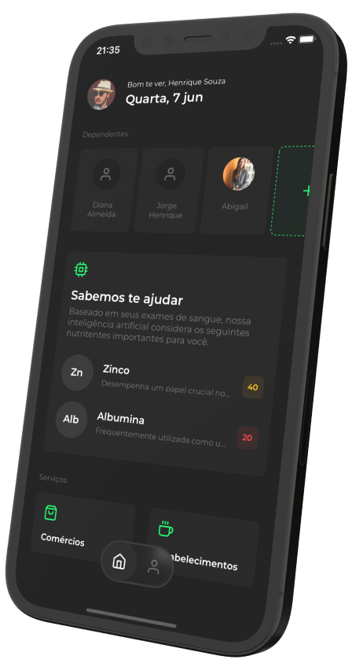

<br>

<h1 align="center">
  
</h1>

<br>

<p align="center">
  <a href="#-Sobre">Sobre</a>
  &nbsp;&nbsp;&nbsp;|&nbsp;&nbsp;&nbsp;
  <a href="#-Tecnologias">Tecnologias</a>
  &nbsp;&nbsp;&nbsp;|&nbsp;&nbsp;&nbsp;
  <a href="#-Funcionalidades">Funcionalidades</a>
  &nbsp;&nbsp;&nbsp;|&nbsp;&nbsp;&nbsp;
  <a href="#-Como-usar">Como usar</a>
</p>

<p align="center">
  
  
</p>

<p align="center">
  
</p>

### 🤳 Sobre

O NutriA chega ao mercado como um aplicativo que une o uso de dados pessoais e laboratoriais, parcerias com empresas, instituições, organizações e inteligência artificial, visando ser um importante aliado no combate à subnutrição/desnutrição que assola o Brasil e o mundo.

O aplicativo será responsável por fornecer uma ficha de nutrição que será desenvolvida através de inteligência artificial treinada para identificar carências em nutrientes através do cruzamentos de dados de resultados de exames laboratoriais, histórico médico e características demográficas, para então identificar usuários que possam estar ou já estão em situação de vulnerabilidade nutricional e possibilitar a sugestão de quais alimentos devem ser consumidos para auxiliar a suprir essa carência através da alimentação.

Clique [aqui](https://www.figma.com/file/xuMhTj8OpK41HE2L8A5ZNM/Beehive-%2B-GS?type=design&node-id=607%3A2&t=UKwFw1JlMsz7MnO8-1) para ver o wireframe no **Figma**.

<br>

### 🚀 Tecnologias

- [PHP](https://www.php.net/)
- [Nginx](https://www.nginx.com/)
- [MySql](https://www.mysql.com/)
- [phpMyAdmin](https://www.phpmyadmin.net/)
- [Docker](https://www.docker.com/)

<br>

### 🪄 Funcionalidades

- Roteamento de endpoints
- Query params
- Handler de resposta

<br>

### 🧑‍💻 Como usar

**Ante de tudo:** o [Docker](https://www.docker.com/) deve estar instalado na máquina.

```bash
# Clone o repositório

$ git clone https://github.com/BeehiveCorp/nutria-api.git
```

```bash
# Suba os containers

$ docker-compose up -d
```

**Containers e funcionamento:**
<br>

- **phpmyadmin:** gerenciador do banco de dados, deve estar disponível da porta 8080. Sobre as credenciais de login, deve inserir "root" como username e "nutriaapp" como password.

- **mysql:** containeriza o banco de dados, que hoje é a versão mais recente do mysql.

- **php-nginx:** a imagem utilizada oferece um ambiente de desenvolvimento com o Nginx como webserver e a versão mais recente do PHP como linguagem de programação. Deve ser acessível na porta 3000
